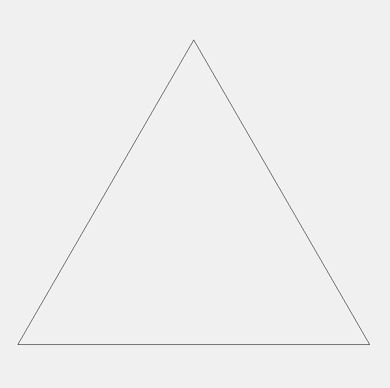

# Triangle Drawer App

 

[](https://github.com/valeriveledara/triangle-drawer/releases)

[](https://github.com/valeriveledara/triangle-drawer/actions/workflows/app.yml)
---
Приложение рисует равносторонние треугольники внутри друг друга, 
процессом можно управлять с помощью клавиш.

Это простое приложение на Python, использующее библиотеку Tkinter 
для создания графического интерфейса. 

Приложение разработано по следующему заданию:
> Требуется составить программу, которая выводила бы на экран равносторонний 
> треугольник. При этом каждый очередной равносторонний треугольник должен 
> выводиться при нажатии клавиши Enter, а при нажатии клавиши ‘D’ убирался 
> бы последний построенный. Выход по ESC. Равносторонние треугольники должны 
> выводиться с заданными шагами уменьшения размера его сторон hx, hy, внутри 
> последнего построенного.

## Демонстрация приложения

---


## Как установить

---

```cmd
git clone git@github.com:valeriveledara/triangle-drawer.git

install python

pip install tk
```


## Как использовать

---
Открыть терминал в исходной папке проекта и выполнить следующую команду:
```cmd
python main.py
```

После запуска, вы увидите окно приложения. Используйте следующие клавиши:

1) Enter: Нарисовать равносторонний треугольник.
2) d: Удалить последний нарисованный равносторонний треугольник.
3) Escape(ESC): Закрыть приложение.

## Лицензия

---

Этот проект лицензирован в соответствии с условиями лицензии [MIT](LICENSE.md).


## Автор

---
  - GitHub: [valeriveledara](https://github.com/valeriveledara)


